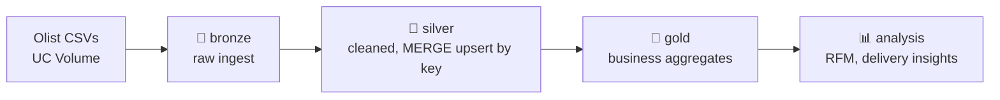

# 🧱 mybrickworks

> A Databricks data platform monorepo — production-style data products built with
> Declarative Automation Bundles (formerly known as Databricks Asset Bundles), Delta Lake and PySpark over open datasets.


## Overview

**mybrickworks** is a monorepo of independent Databricks **data products**, each
deployed as a [Declarative Automation Bundle (DAB)](https://docs.databricks.com/dev-tools/bundles/index.html).
It is built to demonstrate end-to-end data engineering: ingestion, the medallion
architecture (bronze → silver → gold), idempotent upserts with Delta Lake, reusable
packaged libraries, and tested transformation code - not just linear notebooks.

The platform is organized as a **uv workspace**: a shared core library
(`brickworks-core`) provides generic, reusable primitives, while each bundle holds
the business logic for one domain.

## Architecture

### Packaging & reuse

```
notebooks (orchestration)  ──imports──▶  bundle wheel (domain logic)  ──imports──▶  brickworks-core (generic, reusable)
```

- **Functional core, imperative shell** — pure, unit-tested transforms live in the
  wheels; notebooks only orchestrate I/O.
- **Generic vs domain** — anything reusable across products goes to `brickworks-core`;
  domain logic stays in the product's own wheel.

### Data flow (olist_lakehouse)



## Repository structure

```
mybrickworks/
├── pyproject.toml              # uv workspace root + shared tooling (ruff, pytest)
├── libs/
│   └── brickworks_core/        # shared, versioned wheel (IO, transforms, config)
└── bundles/
    └── olist_lakehouse/        # data product: Brazilian e-commerce lakehouse
        ├── databricks.yml      # DAB definition + artifacts (wheels)
        ├── src/olist_lakehouse/  # domain logic (tested)
        ├── notebooks/tables/     # bronze / silver / gold definitions
        └── resources/            # jobs, schedules
```

## Tech stack

| Area | Tools |
|------|-------|
| Compute & storage | Databricks, Delta Lake, Unity Catalog |
| Processing | PySpark, Structured Streaming |
| Packaging | uv (workspace), hatchling wheels |
| Deployment | Databricks Asset Bundles |
| Quality | pytest, ruff |

## Getting started

**Prerequisites:** [uv](https://docs.astral.sh/uv/), the
[Databricks CLI](https://docs.databricks.com/dev-tools/cli/), and access to a
Databricks workspace.

```bash
# 1. Install all workspace dependencies into a single .venv
uv sync --dev

# 2. Configure local-only workspace values (host, user)
cp bundles/olist_lakehouse/databricks.local.yml.example \
   bundles/olist_lakehouse/databricks.local.yml   # then edit it

# 3. Run the tests
uv run pytest

# 4. Deploy a development copy of a bundle
cd bundles/olist_lakehouse
databricks bundle deploy --target dev
databricks bundle run olist_lakehouse
```

## Data products

| Bundle | Domain | Highlights |
|--------|--------|------------|
| `olist_lakehouse` | Brazilian e-commerce (Olist open dataset) | Medallion lakehouse, MERGE upserts, RFM segmentation, delivery analytics |

## Engineering practices

- 🧪 **Tested transforms** — business logic is pure and covered by `pytest`.
- 📦 **Shared library as a versioned wheel** — no copy-pasted utils across bundles.
- 🧱 **Monorepo via uv workspace** — one lockfile, one `.venv`, many products.
- 🔁 **Idempotent ingestion** — Delta `MERGE` creates new rows and updates existing ones.
- ⚙️ **Config-driven** — catalog/schema injected as bundle variables, never hardcoded.

## Roadmap

- [ ] CVE (Common Vulnerabilities and Exposures) data product and dataset explorations.

## License

[MIT](LICENSE)
